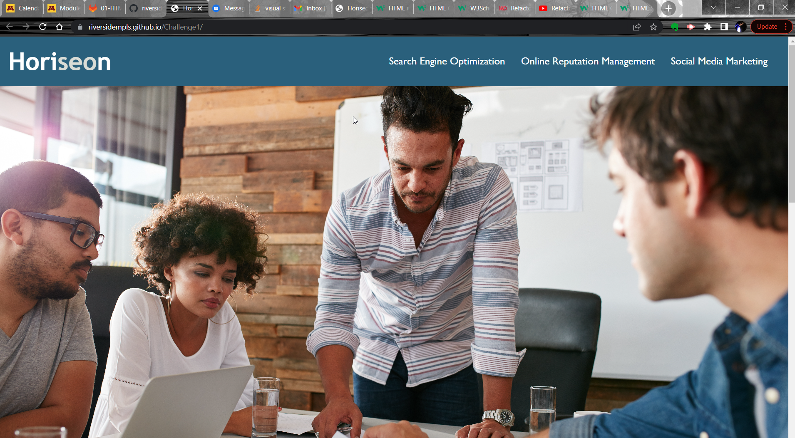

# Challenge 01 HTML, CSS, and Git: Code Refactor
# Submitted by Conor Donnelly - August 31, 2022

The challenge here involved taking a close look at some existing code for a website that needed to be cleaned up and improved for accessibility requirements. Images and Icons on the page were missing ALT text to assist those with visual impariments.

Also, the HTML didn't include semantic tags or comments to help delinate the sectons of the page. The CSS had a lot of redundant classes with identical properties. I removed `
` tags, and replaced with semantic elements.

## Page URL
(https://riversidempls.github.io/Challenge1/)

## Screenshot

